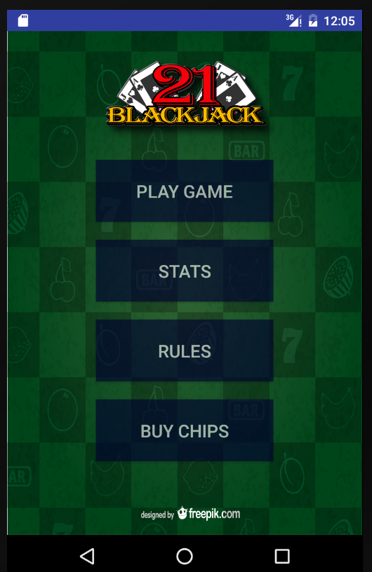
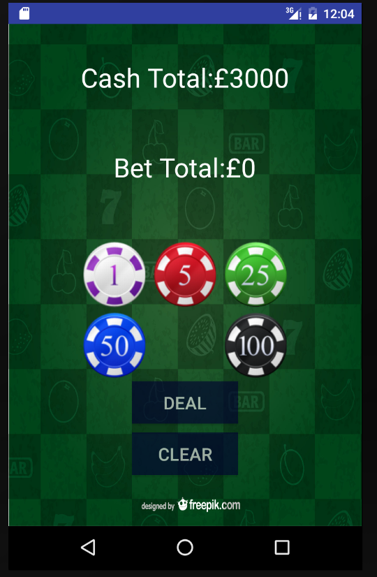
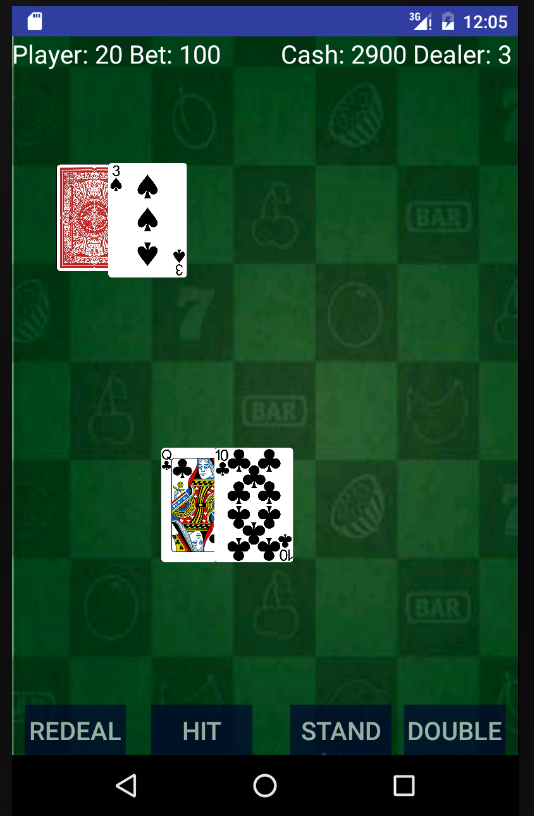

# BlackJack
Android mobile game App using canvas with Java where user can play black jack with an automated dealer in a mobile android phone/tablet.

This project is the second solo project, a 7-day hackathon at [CodeClan](https://codeclan.com/) in Edinburgh.

## Main Functions
- User gets initial betting amount and bet their money before play.
- User gets 2 hands and decide whether to hit/stand/double.
- When user wins, he/she gets doubled amount back. User lose the bet when lose.
- User can play the game as long as he/she has the money left.

## Installation
In order to run the app, you need to install Android Studio.

## TO DO
- Data persistance user's cash
- Add a menu where user can see win-lose analysis
- Add a menu where user can see play time analysis (how long they played in total)
- Enable to shuffle the deck when run out of cards
- If dealer gets black jack, enable the dealer to automatically stand
- When user bust in the first round, enable the dealer to reveal their hands
- When user run out of cash, enable them to purchase more cash

